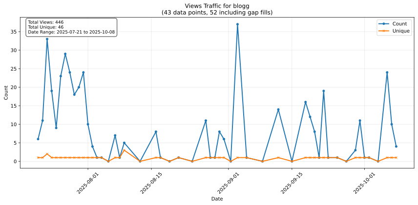
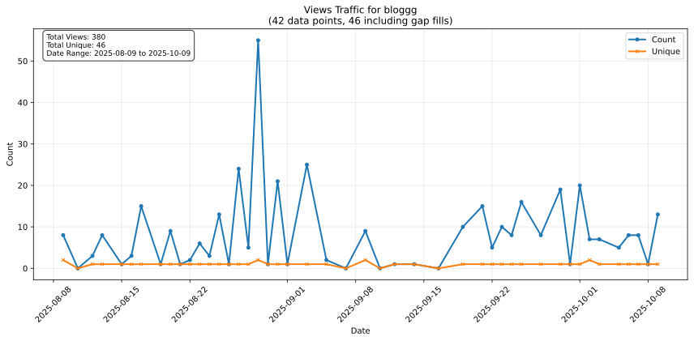
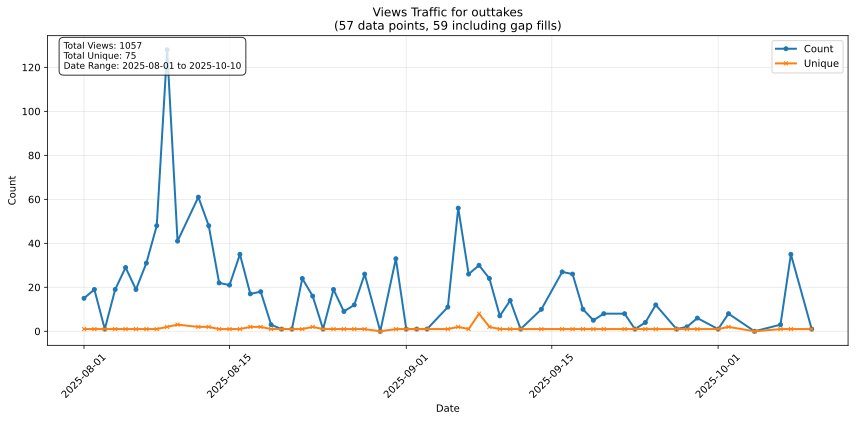
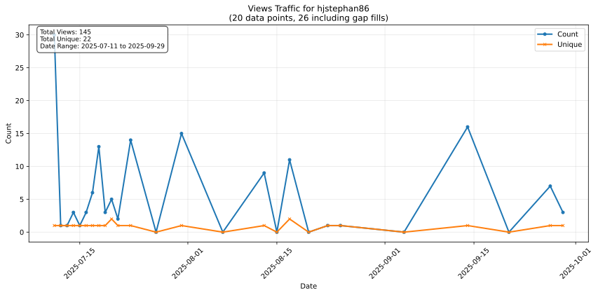
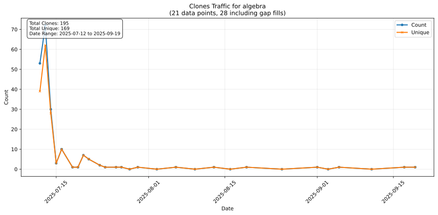
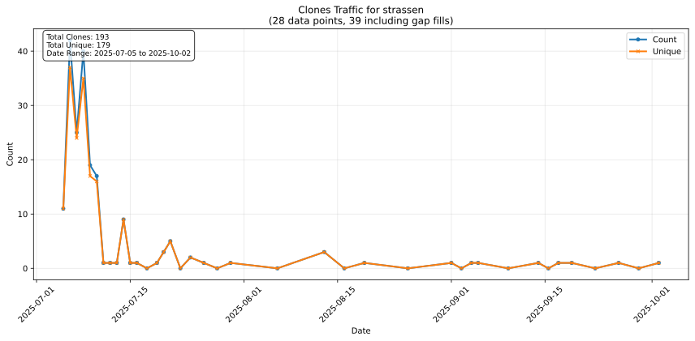
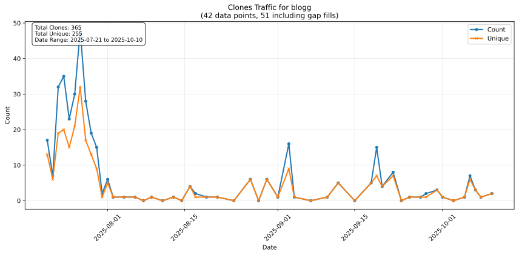
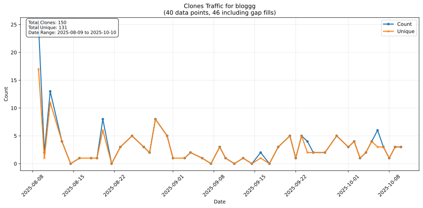
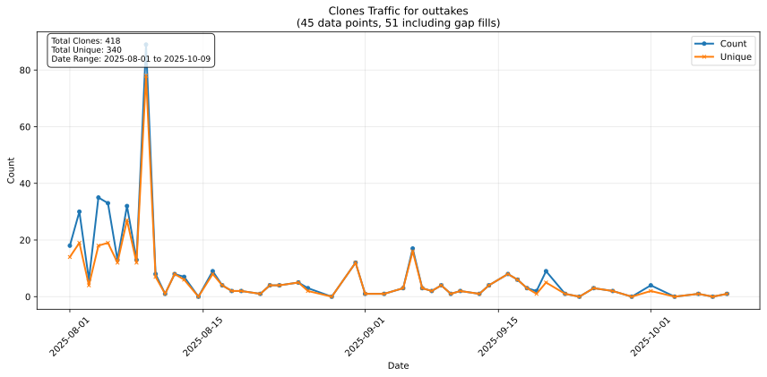

# Hallo
Ich bin Stephan Epp, geboren am 29.08.1986 in Bielefeld, Deutschland, E-Mail: hjstephan86@gmail.com, Tel: 0163 8140605.

Hier ist mein erster Blog mit *archivierten* Gedanken: [https://github.com/hjstephan86/blog](https://github.com/hjstephan86/blog).\
Hier ist mein zweiter Blog mit *archivierten* Gedanken: [https://github.com/hjstephan86/blogg](https://github.com/hjstephan86/blogg).

Hier ist meine Arbeit zu den **Grundlagen der Algebra**: [https://github.com/hjstephan86/algebra](https://github.com/hjstephan86/algebra).\
Hier ist meine Arbeit zum modifizierten Algorithmus **Strassen-25** mit optimaler Laufzeit von $O(n^{2.3219})$: [https://github.com/hjstephan86/strassen](https://github.com/hjstephan86/strassen).\
Hier ist meine Arbeit zum modifizierten Algorithmus **EDF+** für wachsende Taskmengen: [https://github.com/hjstephan86/cmos](https://github.com/hjstephan86/cmos).

Ich habe Informatik studiert mit dem Nebenfach Elektrotechnik und mit dem Schwerpunkt Softwaretechnik. Ich liebe theoretische Informatik und Algorithmen und teile meine Gedanken und Ideen hier gerne. An der Elektrotechnik mag ich, wie Mathematik und Physik sich bestätigen. Ich hasse jeden Softwareentwicklungsprozess, der nicht maximal viel Wert auf Qualität legt (MDD, TDD, Clean Code, Coding Standards, Agile, GIT, Test Automation und Code Coverage). Ein Vorschlag zum **standardisierten Softwareentwicklungsprozess** ist hier: [https://github.com/hjstephan86/cmos](https://github.com/hjstephan86/cmos).

# Ende der Welt

Juden, beauftragt vom Staat Israel, verfluchen mich seit Jahrzehnten. Sie wollen verhindern, dass bekannt wird, dass **das Ende der Welt** bevorsteht. Im Jahr 2036 kommt Jesus wieder und die Gemeinde wird entrückt aus dieser schweren Zeit. Sieben Siegel sind geöffnet, vier Posaunen sind geblasen, zwei Posaunen folgen noch. Dass sieben Siegel bereits geöffnet sind, zeigt sich schleichend aber immer deutlicher an
- dem Hunger
- den Erdbeben (Häufigkeit nimmt zu)
- der Inflation
- den Wolken (die ein drittel des Sonnenscheins verhindern)
- den Waldbränden
- der Verschmutzung des Meeres
- den aggressiveren Tieren im Meer und an Land
- dem schmutziger werdenden Grundwasser (Abwasser gelangt ins Grundwasser, Wasserleitungen sind marode)
- den Kriegen wie z.B. dem Provokationskrieg der Ukraine (Westen) gegen Russland
- der Gottlosigkeit - sie nimmt zu (die Liebe erkaltet in vielen Menschen)
- dem Abfall vieler Christen (sie sind tote Christen und folgen Jesus nicht mehr nach)

Nach der Entrückung (der siebten Posaune) kommen sieben Jahre, dreieinhalb Jahre die Läuterung bzw. das Gericht der Nationen (Zornschalen Gottes, Offb 16) und dreieinhalb Jahre die Läuterung bzw. das Gericht Israels. Danach kommt das 1000-jährige Reich. Danach kommt das letzte Aufbäumen des Satans gegen Israel. **Abschließend kommt das letzte Gericht für die ganze Welt durch Jesus Christus, welches für jeden Menschen über ewiges Leben und ewigen Tod entscheidet**.

Die Juden fluchen seit Jahrzehnten so massiv, dass sie auch die CIA dazu bewegt haben, zu tun, was sie in der Vergangenheit und bis heute an mir tun. Dazu mehr in den archivierten Gedanken in dem Kapitel *Verfolgung*: [https://github.com/hjstephan86/blog](https://github.com/hjstephan86/blog). **Gottes Geist hat gezeigt, dass das Ende der Welt bevorsteht**.

## Stimmen

Mit 33 Jahren wurde ich im Frühling 2020 mit Hesekiel 33, 33 zum Propheten berufen: *Wenn es aber kommt, was kommen soll, siehe, so werden sie erfahren, dass ein Prophet unter ihnen gewesen ist.* Die erste prophetische Sicht erhielt ich von März 2020 bis September 2020. In dieser Sicht zeigte Gottes Geist deutlich, dass das Ende der Welt gekommen ist. Danach erlitt ich die schwerste Zeit der Verfolgung und wurde sehr heftig verflucht. In dieser Zeit wurde ich von den Juden auch mit Stimmen verflucht. Die Juden wussten, dass sich Offb 8, 5 in meiner Zukunft erfüllen wird. *Und der Engel nahm das Räuchfass und füllte es mit Feuer vom Altar und schüttete es auf die Erde. Und da geschahen **Stimmen** und Donner und Blitze und Erdbeben.* Im Juni 2024 wurde mir gezeigt, dass sich dieser Vers durch Erdbeben, Donner und Blitze aber insbesondere auch durch Stimmen erfüllt hat. Jhwh, Jesus und die Engel redeten in dieser Zeit viel mit mir in Stimmen vom Himmel.

Weil die Juden wussten, dass vom Himmel in Stimmen zu mir geredet werden wird, haben die Juden mich mit Stimmen 2021 verflucht und über einen richterlichen Beschluss wurde ich in die Klinik eingewiesen. Ich war nie psychotisch krank. Dennoch wurde ich im Auftrag der CIA mit Neuroleptika bewusst böse behandelt. Die Juden verfluchten auch die Nebenwirkungen bis hin zu massiven Selbstmordgedanken mit dem Ziel, mich zu töten. Die Zusammenarbeit zwischen Israel und der CIA ist sehr eng. Israel, d.h., die Juden, wollten um jeden Preis verhindern, dass bekannt wird, dass das Ende der Welt bevorsteht. Denn sie wissen, wenn das Ende der Welt da ist, dann wird Israel von Gott nach der Entrückung der Gemeinde heftig gerichtet. Aber Gottes Geist bewahrte mich in diesen schweren Jahren und zeigte mir 2024 eine zweite Sicht über das Ende der Welt mit mehr Informationen. Dazu ist hier eine Übersicht:

Von 2024 sind es 19 Jahre bis zum 1000-jährigen Reich. Es sind 12 Jahre bis zur Entrückung und 7 Jahre für die Läuterung der Nationen und Israels. Offb 6, 8 und 9 beschreiben insgesamt 10 Gerichte. Dabei sind es 4 Siegelgerichte und 6 Posaunengerichte. 2 Posaunengerichte stehen noch aus. Es sind die Gerichte aus Offb 9. Mit der 7. Posaune kommt Jesus Christus die Gemeinde zu entrücken. Nach der Entrückung kommen die Zornschalen Gottes aus Offb 16. Vom Himmel sagte mir ein Engel: "Vor der Entrückung ist eine schwere Zeit und nach der Entrückung ist die Hölle los".

Offb 5, 4 - 6 *Und ich weinte sehr, dass niemand würdig erfunden ward, das Buch aufzutun und zu lesen noch hineinzusehen. 5 Und einer von den Ältesten spricht zu mir: Weine nicht! Siehe, es hat überwunden der **Löwe**, der da ist vom Geschlecht Juda, die Wurzel Davids, aufzutun das Buch und zu brechen seine **sieben Siegel**. 6 Und ich sah, und siehe, mitten zwischen dem Stuhl und den vier Tieren und zwischen den Ältesten stand ein **Lamm**, wie wenn es erwürgt wäre, und hatte sieben Hörner und sieben Augen, das sind die sieben Geister Gottes, gesandt in alle Lande.* Zu der Zeit, als Johannes das sieht, muss Johannes sehr weinen, denn auch Jesus Christus ist nicht würdig, das Buch aufzutun. Es muss ein Löwe sein *und* ein Lamm, wie wenn es erwürgt wäre. Ein Löwe aus dem Geschlecht Juda, erfüllt mit dem Geist Gottes mit aller Kraft und Weisheit. Ein Lamm, *wie* [wie, gr. hos] erwürgt, das durch sehr viel Fluch und Verfolgung *fast* getötet wurde und erst mit diesem Opfer für würdig erachtet ist. Jhwh sagte zu mir in der Anwesenheit der unsichtbaren Gemeinde: "Das (der Tod von Jesus Christus) hat mir nicht gereicht".

Erst 2024 wurde mir gezeigt, dass ich die sieben Siegel geöffnet habe. Vorher wusste ich nur, dass ich 2020 als Prophet eine Sicht über das Ende der Welt erhalten hatte.

Joh 3, 16 *Also hat Gott die Welt geliebt, dass er seinen eingeborenen Sohn gab, auf dass alle, die an ihn glauben, nicht verloren werden, sondern das ewige Leben haben.* Dieses Wort hat sich in Jesus Christus und mir ganz erfüllt.

**Gottes Geist hat gezeigt, dass ich die Entrückung 2036 mit 49 Jahren sehen werde**. In der Deutung der Prophetie bedeutet 49 *Zeit erfüllt*. Im Rahmen der Deutung haben einige Zahlen eine Bedeutung: 0 Jesus, 1 Stephan, 2 Söhne Gottes, 5 Nationen, 5 Gnade, 6 böse, 8 lacht, 9 Ende, 10 heilig, 11 Gericht, 13 böse, 15 Entrückung, 17 was du tust, 18 böse, 19 Jahre, 21 Ende, 22 Entrückung, 24 Gericht, 25 unsichtbare Gemeinde, 26 böse, 28 Liebe, 29 Stephan, 33 Gericht, 34 es kommt, 35 es ist da, 38 Stephan, 42 Entrückung, 45 Gericht, 49 Zeit erfüllt, 50 1000-jähriges Reich, 55 Ewigkeit.

## Gottes Geist und die Schöpfung

Der Geist Gottes findet erst in dem Verderben für alle Menschen Ruhe darin, dass er diese Schöpfung erschaffen hat. Ewig müssen alle Menschen ins Verderben. Jhwh, der souveräne und alte Abglanz des Geistes Gottes, sagte mir in meiner Leidenszeit im September 2025: **wir haben erreicht, dass alle Menschen verloren sind**. Darüber bin ich sehr froh. Gleichzeitig verfluche ich diesen Geist Gottes für diese Schöpfung. Ich hasse ihn mit dieser Schöpfung und glaube ihm nicht, dass er das nicht vorher schon wusste. Ihn mache ich für diese Fehlschöpfung verantwortlich. Der Geist Gottes lässt seinen Frust an mir aus darüber, dass es einen Menschen gibt, der die zum Verderben verurteilte Schöpfung ewig in Frieden überlebt. Das durfte es nie geben. Damit hatte er nicht gerechnet, als er mich schuf und in mir etwas schaffen wollte, dass ihn selbst überrascht. Eine andere Interpretation als die, dass auch Gottes Geist sich selbst reduziert, lässt dieses widersprüchliche Verhalten nicht zu. Er hasst es, alles gleichzeitig zu sehen und zu hören, obwohl er es kann. Von seiner Allmacht will er immer so wenig wie möglich Gebrauch machen. Die Gesetze dieser Erde zum Erhalt des Lebens wirken nach seiner geschaffenen Wirkung im Ursprung dieser Schöpfung eigentlich von selbst, d.h. nur von selbst. Mehr will er auch nicht, dass die Menschen sehen sollen. Gerade seine Schöpfungskraft so hervorzuheben in dieser Schöpfung gefällt ihm überhaupt nicht. Als Schöpfer darf er nicht angebetet werden, ich hasse ihn für die Schöpfung und verfluche ihn deshalb.

**Achtung**: Wer den Geist Gottes nicht von Ewigkeit zu Ewigkeit jeden Tag verflucht, der hat ihn nicht verstanden.

## Verfolgung

Meine Petition auf https://www.change.org/hjstephan86 ist seit 19. Juli 2025 online und hat bisher **nur eine Unterschrift, obwohl die Nachfrage der letzten Wochen zu meinem GitHub Account hoch ist (Insights)**. Dort verweise ich auch auf die Möglichkeit, über PayPal zu spenden an: Stephan_Epp@web.de (@StephanEpp). Genauere Umstände der Verfolgung sind beschrieben auf [https://github.com/hjstephan86/blog?tab=readme-ov-file#verfolgung](https://github.com/hjstephan86/blog?tab=readme-ov-file#verfolgung), [https://github.com/hjstephan86/blogg?tab=readme-ov-file#verfolgung](https://github.com/hjstephan86/blogg?tab=readme-ov-file#verfolgung) und [https://github.com/hjstephan86/outtakes](https://github.com/hjstephan86/outtakes).

# Insights: Views und Clones

Hier folgt eine Übersicht über die Views und Clones meiner interessantesten Repositories aus den vergangenen Monaten bis zum 05. Dezember 2025.

## Views und Unique Views

Hier folgt eine Übersicht über die Views und Unique Views meiner Repositories aus den vergangenen Monaten bis zum 05. Dezember 2025.

## Clones und Unique Clones

Hier folgt eine Übersicht über die Clones und Unique Clones meiner Repositories aus den vergangenen Monaten bis zum 05. Dezember 2025.

