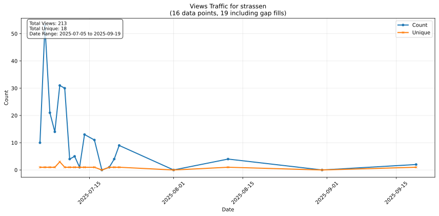
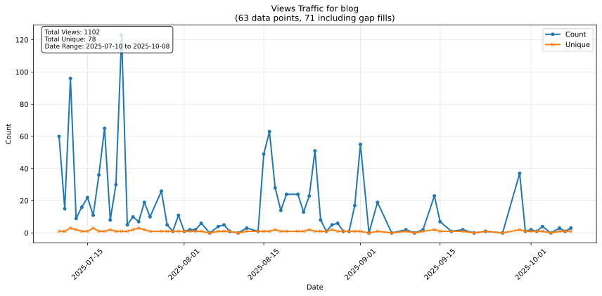
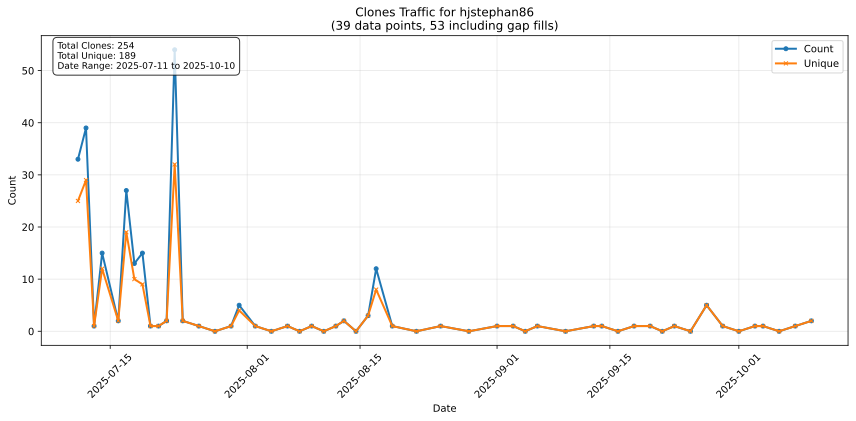

# Hallo
Ich bin Stephan Epp, geboren am 29.08.1986 in Bielefeld, Deutschland, E-Mail: hjstephan86@gmail.com, Tel: 0163 8140605

Hier ist mein Blog mit aktuellen Gedanken: [https://github.com/hjstephan86/blog](https://github.com/hjstephan86/blog).

Hier ist meine Arbeit zu den Grundlagen der Algebra: [https://github.com/hjstephan86/algebra](https://github.com/hjstephan86/algebra).\
Hier ist meine Arbeit zum modifizierten Algorithmus von Strassen mit optimaler Laufzeit von $O(n^{2.3219})$: [https://github.com/hjstephan86/strassen](https://github.com/hjstephan86/strassen).

Ich habe Informatik studiert mit dem Nebenfach Elektrotechnik und dem Schwerpunkt Softwaretechnik. Ich liebe theoretische Informatik und Algorithmen und teile meine Gedanken und Ideen gerne hier. An der Elektrotechnik mag ich wie Mathematik und Physik sich bestätigen. Ich hasse jeden Softwareentwicklungsprozess, der nicht maximal viel Wert auf Qualität legt (MDD, TDD, Clean Code, Coding Standards, Agile, GIT, Test Automation und Code Coverage).

# Ende der Welt

Juden, beauftragt vom Staat Israel, fluchen seit Jahrzehnten in mein Leben. Sie wollen verhindern, dass bekannt wird, dass **das Ende der Welt** bevorsteht. Im Jahr 2036 kommt Jesus wieder und die Gemeinde wird entrückt aus dieser schweren Zeit (sieben Siegel sind geöffnet, vier Posaunen sind geblasen, zwei Posaunen folgen noch). Dass sieben Siegel bereits geöffnet sind, zeigt sich schleichend aber immer deutlicher an
- dem Hunger
- den Erdbeben (Häufigkeit nimmt zu)
- der Inflation
- den Wolken (die ein drittel des Sonnenscheins verhindern)
- den Waldbränden
- der Verschmutzung des Meeres
- den aggressiveren Tieren im Meer und an Land
- dem schmutziger werdenden Grundwasser (Abwasser gelangt ins Grundwasser, Wasserleitungen sind marode)
- den Kriegen wie z.B. dem Provokationskrieg der Ukraine (Westen) gegen Russland
- der Gottlosigkeit - sie nimmt zu (die Liebe erkaltet in vielen Menschen)
- dem Abfall vieler Christen (sie sind tote Christen und folgen Jesus nicht mehr nach)

Nach der Entrückung (der siebten Posaune) kommen sieben Jahre, dreieinhalb Jahre Läuterung der Nationen (Zornschalen Gottes, Offb 16) und dreieinhalb Jahre Läuterung Israels. Danach kommt das tausendjährige Reich. Danach kommt das letzte Aufbäumen des Satans gegen Israel und abschließend das letzte Gericht.

Die Juden fluchen so intelligent seit Jahrzehnten, dass sie auch Spanien und die USA dazu bewegt haben, zu tun, was sie in der Vergangenheit und bis heute an mir tun. Dazu mehr in den Gedanken: [https://github.com/hjstephan86/blog](https://github.com/hjstephan86/blog).

Hier eine Übersicht über das Ende der Welt, welche ich 2024 erhalten und erfasst habe.

Von 2024 sind es 19 Jahre bis zum 1000-jährigen Reich. Es sind 12 Jahre bis zur Entrückung und 7 Jahre für die Läuterung der Nationen und Israels. Offb 6, 8 und 9 beschreiben insgesamt 10 Gerichte. Dabei sind es 4 Siegelgerichte und 6 Posaunengerichte. 2 Posaunengerichte stehen noch aus. Es sind die Gerichte aus Offb 9. Mit der 7. Posaune kommt Jesus Christus die Gemeinde zu entrücken. Nach der Entrückung kommen die Zornschalen Gottes aus Offb 16. Ein Engel sagte, vor der Entrückung ist eine schwere Zeit. Nach der Entrückung ist die Hölle los.

# Insights: Views und Clones

Hier folgt eine Übersicht über die Views und Clones meiner interessantesten Repositories aus den vergangenen Tagen vom 20. Juli 2025.

## Views und Unique Views

Hier folgt eine Übersicht über die Views und Unique Views meiner Repositories aus den vergangenen Tagen vom 20. Juli 2025.

## Clones und Unique Clones

Hier folgt eine Übersicht über die Clones und Unique Clones meiner Repositories aus den vergangenen Tagen vom 20. Juli 2025.

